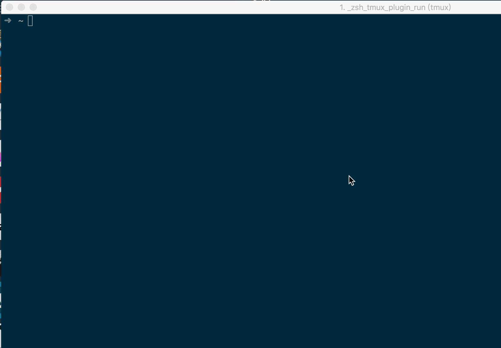

## WOL

> 这是一个使用 go 编写的简单的 WOL(Wake on LAN) 工具，主要用于远程开机(需要主板支持)，工具参考了 [sabhiram/go-wol](https://github.com/sabhiram/go-wol) 的部分代码

### 使用




```sh
➜ ./wol

A simple WOL tool

Usage:
  wol [flags]
  wol [command]

Available Commands:
  add         Add machine
  del         Delete machine
  help        Help about any command
  ls          List machines
  wake        Wake on LAN

Flags:
      --config string      config file (default is $HOME/.wol.yaml)
  -h, --help               help for wol
  -i, --interface string   Broadcast Interface
  -b, --ip string          Broadcast IP (default "255.255.255.255")
  -p, --port int           UDP Port (default 7)

Use "wol [command] --help" for more information about a command.

```